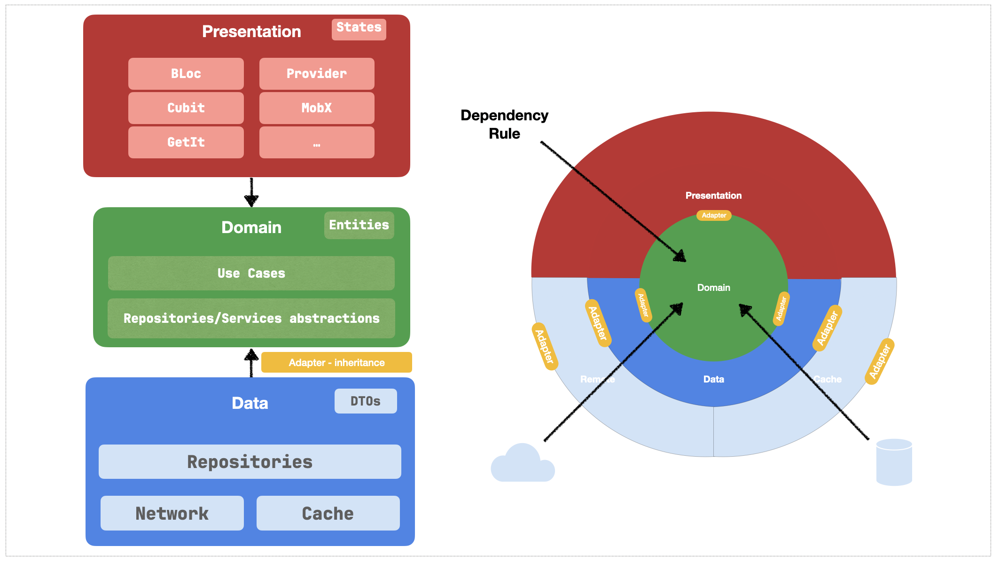

# Clean Architecture in Flutter

## Cos'è la Clean Architecture?

La Clean Architecture è un modello di architettura del software proposto da Robert C. Martin (alias Uncle Bob). L'obiettivo principale della Clean Architecture è creare sistemi che siano indipendenti dai framework, facilmente testabili, e con una chiara separazione delle responsabilità. In altre parole, si tratta di organizzare il codice in modo tale che sia robusto, riutilizzabile e facile da mantenere.

## Struttura della Clean Architecture



La Clean Architecture è strutturata in una serie di cerchi concentrici, dove ogni cerchio rappresenta un diverso livello di responsabilità. Questi livelli sono:

### Livello Domain

Il livello `domain` è il cuore della tua applicazione. Contiene la logica di business e le regole fondamentali del dominio. È completamente indipendente da qualsiasi framework o dettaglio di implementazione esterno, il che lo rende facilmente testabile e riutilizzabile.

- **Entities**: Le entità sono oggetti di business che rappresentano i concetti chiave della tua applicazione. Contengono la logica di business più fondamentale e duratura. Esempio:
  ```dart
  class User {
    final String id;
    final String name;
    final String email;

    User({required this.id, required this.name, required this.email});
  }

- **Repositories**: Le interfacce dei repository definiscono i metodi per accedere ai dati necessari per le entità e i casi d'uso. Queste interfacce vengono implementate nel livello data. Esempio:
  ```dart
    abstract class UserRepository {
  Future<User> getUserById(String id);
  Future<void> addUser(User user);
}

- **Use Cases**:  I casi d'uso contengono la logica specifica delle applicazioni e orchestrano il flusso dei dati tra gli oggetti del dominio. Eseguono operazioni di business e coordinano le interazioni con le entità. Esempio:
  ```dart
    class GetUser {
  final UserRepository repository;

  GetUser(this.repository);

  Future<User> call(String id) {
    return repository.getUserById(id);
  }
}

### Livello Data

Il livello data contiene le implementazioni dei repository, i modelli dei dati e le fonti dei dati (API, database locale, ecc.). È responsabile di fornire i dati al livello domain.

- **DTO**:  I modelli rappresentano i dati che vengono scambiati tra le diverse fonti di dati e il dominio. Sono spesso mappati alle entità del dominio. Esempio:
  ```dart
  class UserModel extends User {
  UserModel({required String id, required String name, required String email})
    : super(id: id, name: name, email: email);

  factory UserModel.fromJson(Map<String, dynamic> json) {
    return UserModel(
      id: json['id'],
      name: json['name'],
      email: json['email'],
    );
  }

  Map<String, dynamic> toJson() {
    return {
      'id': id,
      'name': name,
      'email': email,
    };
  }
}

- **Repositories Implementation**: Le implementazioni dei repository forniscono l'accesso ai dati. Queste classi interagiscono con le fonti di dati esterne e mappano i dati ai modelli del dominio.
  
- **Sources**: Le fonti di dati contengono le implementazioni per accedere ai dati da API, database locali o altre fonti esterne.

### Livello Presentation

Il livello presentation contiene il codice relativo alla presentazione dell'applicazione, come i blocchi (Business Logic Component), gli schermi e i widget. È responsabile dell'interazione con l'utente.

- **BLOC**:  I bloc (Business Logic Component) gestiscono lo stato e la logica di presentazione della tua applicazione. Ricevono eventi dal livello di presentazione e emettono stati aggiornati.

- **Pages**: Gli schermi definiscono le diverse interfacce utente della tua applicazione. Contengono widget e logica di layout.
  
- **Widgets**: I widget sono componenti riutilizzabili che possono essere utilizzati in più schermate. Sono responsabili della visualizzazione e della gestione dell'interfaccia utente.


## Implementazione della Clean Architecture in Flutter

Nella tua applicazione Flutter, puoi seguire questa struttura organizzativa per aderire ai principi della Clean Architecture:

```markdown
- lib/
  - src/
    - domain/
      - entities/
      - repositories/
      - usecases/
    - data/
      - dto/
      - repositories_impl/
      - sources/
    - presentation/
      - bloc/
      - pages/
      - widgets/
    - core/
      - configs/
      - usescase/
    - common/ 
